# Topic Overview
Modern biophysical methods are capable of detecting individual molecules. These methods have led to many of the most recent advances in biology. In this topic we will examine how these methods work, and why an analysis of biological systems at the level of individual molecules is so powerful. We will focus on recent advances in single-molecule fluorescence imaging and nanoscopy, applied to protein function and cell biology.


<!-- c -->
<!-- csl: american-chemical-society.csl -->
<!-- csl: annual-reviews-without-titles.csl -->

<!-- ```{example}
An example
``` -->


##Syllabus
1.	Single-molecule vs. ensemble measurements. Volume reduction in the optical detection of single-molecules. 
2.	An appreciation of the important photo-physical mechanisms in single-molecule imaging. Super-resolution imaging.
3.	Kinetics and thermodynamic properties from single-molecule measurements.
4.	Application of single-molecule fluorescence microscopy to protein conformational change.

##Reading List
Joseph R. Lakowicz 2006.  **[Principles of Fluorescence Spectroscopy](http://dx.doi.org/10.1007/978-0-387-46312-4).** Boston, MA: Springer US. Chapter 23.

Rob Philipps, Jane Kondev, Julie Theriot, Heman Garcia 2012. [**Physical Biology of the Cell**](http://www.garlandscience.com/product/isbn/9780815344506).

Alex E. Knight 2009.  [**Single molecule biology**](http://www.sciencedirect.com/science/book/9780123742278). Amsterdam: Elsevier.

Joo, Chirlmin, Hamza Balci, Yuji Ishitsuka, Chittanon Buranachai, and Taekjip Ha. 2008. **[Advances in Single-Molecule Fluorescence Methods for Molecular Biology](doi:10.1146/annurev.biochem.77.070606.101543).**  _Annual Review of Biochemistry_ 77: 51–76.

Xavier Michalet, Shimon Weiss, and Marcus Jäger 2006. [**Single-Molecule Fluorescence Studies of Protein Folding and Conformational Dynamics**.](http://pubs.acs.org/doi/abs/10.1021/cr0404343) _Chemical Reviews_ 106: 1785-1813.

Takejip Ha. [**Developing single molecule technologies to study nanomachines**.]( https://www.ibiology.org/ibioseminars/developing-single-molecule-technologies-study-nanomachines.html) (ibiology.org).


##Teaching resources
- Handouts vs. slides
- online

#Why study single molecules?
Biomolecules often exhibit complex behaviour. For example many different conformational states might be needed for a protein to perform its function. It is only by examining a system at the level of individual molecules that this complex and dynamic behaviour can be measured and understood. Over the last two decades, single-molecule methods have revolutionised our understanding of molecular and cellular biology.

##Heterogeneity of population
Single-molecule methods report not just properties averaged over a large ensemble, but rather show the distribution of these values. For biomolecules, being able to resolve different conformational states is important. [Chapter 23, @Lakowicz]

**Static heterogeneity** occurs when an ensemble of molecules contains populations sufficiently stable that they do not interconvert over the timescale of the observation. 

**Dynamic heterogeneity** occurs when a sample contains a population of molecules that now interconvert over the timescale of the observation.

```{r,echo=FALSE,fig.margin = TRUE, auto_pdf=TRUE, fig.align='center', fig.cap="Comparison of single-molecule and ensemble emission spectra. (Lakowicz, p.758)"}
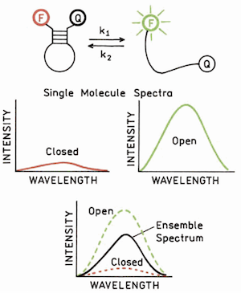
```

##Kinetics at equilibrium
The second advantage of a single-molecule measurement is that kinetics can be measured without needed to first synchronise the population of molecules. For complex multi-step reactions like those you might expect to observe for a biomolecule this is very useful. It is often impossible to synchronise a biomolecule population to transition from a particular state. For a single-molecule measurement kinetics can be measured as dynamic fluctuations from a population that is in equilibrium. 

```{r,echo=FALSE,fig.margin = FALSE, auto_pdf=TRUE, fig.align='center', fig.cap="Comparison of single-molecule and ensemble kinetics for enzyme turnover without synchronisation. (Lakowicz p.758)"}
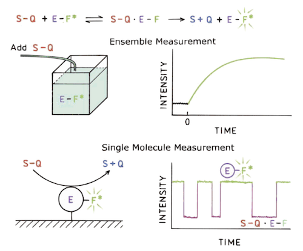
```

##Rare events
The third advantage is in detecting individual molecules. Many proteins are expressed at copy numbers where you might expect to only find one per cell. To understand their function, the ability to resolve individual molecules is obviously pretty important.

##Types of single-molecule detection
Different molecular properties can be used to detect single molecules. We will focus first on optical methods, followed by force and charge.


Table: (\#tab:foo) Example single-molecule detection methods.

| Measurement| Example Technique| 
|------------:|-----------:|
|          Light|         Single-molecule Fluorescence |
|         Force|         Atomic Force Microscopy|
|             |         Optical Tweezers|
|          Charge|         Scanning Tunnelling Electron Microscopy|
|             |         Single-Channel Electrophysiology|
\newpage

#Fluorescence detection of single molecules
Detecting single molecules by light absorption or scattering is difficult. Far easier is to detect 10,000’s of photons (per second per molecule) emitted by fluorescence. Fluorescence also allow us to exploit the *Stokes shift* to separate excitation light from emission.

##How to detect single molecules?
To detect single molecules, a signal must be resolvable above background noise. For fluorescence, even if all sources of sample contamination are removed, intrinsic Raman scattering from water cannot be removed.

In addition to being absorbed and emitted, light can be scattered by molecules. **Raleigh scattering** occurs if photons are elastically scattered from a molecule. If light is scattered inelastically (exchanging energy with the molecule), it gives rise to **Raman scattering**.^[Chapter 12 @atkins_2014-Md; also @brown_1998-HB] Scattering is a two-photon process (one in, one out), it is intrinsically weaker than single-photon absorption.

```{r,echo=FALSE,fig.margin = TRUE, auto_pdf=TRUE, fig.align='center', fig.cap="Raman Scattering. (Atkins, Physical Chemistry, Fig. 12.1)"}
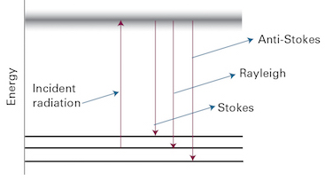
```

##Volume reduction
It is only by **volume reduction** that single molecules can be successfully resolved. Even though Raman cross sections are smaller ($\sim10^{-28} \textrm{cm}^{-2}$) than absorption cross sections ($\sim10^{-16} \textrm{cm}^{-2}$), the number of water molecules in an experiment is typically very large. But by reducing the volume from which fluorescence is detected, single-molecule sensitivity can be achieved.

Recall that cross sections are a measure of the probability of a particular interaction (e.g. absorption, scattering). Recall the Beer-Lambert law 

\begin{equation}
\log{I/I_0}=\epsilon l c=A
\end{equation}

where $\epsilon$ is the molar extinction (absorption) coefficient and $c$ is the concentration. The molecular equivalent uses the absorption cross section $\sigma_A$, and number of molecules $N$. 

\begin{equation}
\ln{I/I_0}=\sigma_A l N
\end{equation}

Qualitatively you should appreciate how reducing the detection volume in an experiment might help things, but can we be quantitative? Let's take the following example from Lakowicz:^[@Lakowicz] The Raman cross-section ($\sigma_s$) for a water molecule is $10^{-28} \textrm{cm}^{2}$. The number of molecule $N$ in 1 ml of H$_2$O is $3.3 \times 10^{22}$. The total Raman scatter from 1 ml of water can be calculated as  $\sigma_s N$. Let's compare that to the signal from a single fluorophore: Assuming unitary quantum yield, the fluorescence signal from a single Rhodamine 6G fluorophore is approximately the same as its absorption cross section ($\sigma_A =10^{-28} \textrm{cm}^{2}$) So the background Raman signal from the water is approximately $10^{10}$-fold greater than the signal from the single fluorophore.

Contrast this with a volume of 1 cubic micron. The total fluorescence signal has not changed, but there are now only $3.3 \times 10^7$ water molecules. Our signal is now approximately 100 times larger than the background and we can detect single molecules.

We just need experiments that restrict the volume from which signals are detected to around $10^{-18}\textrm{m}^3$, or 1 femtolitre.

##Confocal detection
```{r,echo=FALSE,fig.margin = FALSE, auto_pdf=TRUE, fig.align='center', fig.cap="Confocal detection. By placing a small pinhole in a conjugate image plane, we restrict the collected  light to a small region above and below the image plane. (Lakowicz)"}
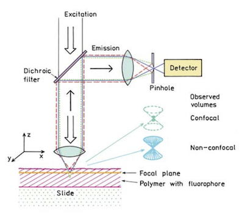
``` 

We can exploit the fact that visible light can be focused down to the **diffraction limit** of a few 100 nm to restrict xy dimensions. Combined with a **confocal pinhole**, we can also restrict our z detection to around 1 $\mu$m. 

```{r,echo=FALSE,fig.margin = TRUE, auto_pdf=TRUE, fig.align='center', fig.cap="Example confocal detection of single-molecule fluorescence"}
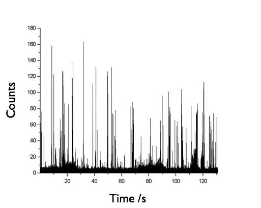
``` 

For sufficiently dilute samples (~100 fl) as an individual fluorescent molecule diffuse through this confocal volume they can be resolved as a 'burst' of emitted light. 


##The diffraction limit 
Why can light only be focused to a spot of a few 100 nm? Why can't we just use a light microscope to image the structure of molecules? To understand this some geometric optics is neded.^[For a comprehensive introduction see @hecht_2001-TD] There is a fundamental limit to the resolution with which we can resolve two objects using light. This **diffraction limit** is approximately half the wavelength of the light used to image the object, and is due to the constructive and destructive **interference** of light waves.

```{r,echo=FALSE,fig.margin = FALSE, auto_pdf=TRUE, fig.align='center', fig.cap="A Resolution limit from interference. (microscopyu.com)"}
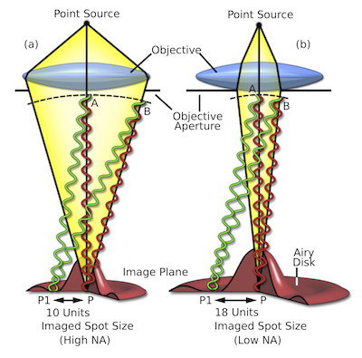
``` 

This can be quantified in terms the Abbe diffraction limit,

\begin{equation} 
d=\frac{\lambda}{2n\sin{\theta}}=\frac{\lambda}{2\,\textrm{N.A.}}
\end{equation} 

where $d$ is the spot radius, $\lambda$ is the wavelength, $n$ is the refractive index of the medium, and $\textrm{N.A.}$ is the numerical aperture of the lens.

In practice what is often measured is the **Rayleigh diffraction limit**^[http://hyperphysics.phy-astr.gsu.edu/hbase/phyopt/Raylei.html], where the first diffraction minimum of the image of one source point coincides with the maximum of another.

\begin{equation} 
d=0.61\frac{\lambda}{\textrm{N.A.}}
\end{equation} 

```{r,echo=FALSE,fig.margin = FALSE, fig.height=1, auto_pdf=TRUE, fig.align='center', fig.cap="Rayleigh diffraction limit. (hyperphysics.phy-astr.gsu.edu)"}
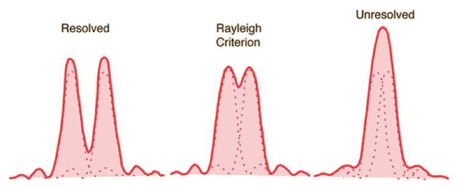
```

For visible light and typical microscope lenses, the diffraction limit is of the order of a few 100 nm.

##Total Internal Reflection Fluorescence (TIRF)
A second common method to achieve volume reduction is to exploit Total Internal Reflection (TIR).^[@axelrod_1984-Pe] Snell's law describes what happens when light encounters a change in refractive index; at an angle of incidence greater than the critical angle it is reflected. 

Although the light reflects, there is a component of the electromagnetic field that is present just above the interface in the second medium. This **evanescent field** decays exponentially in intensity with perpendicular distance above the surface. For visible light, the **penetration depth** is only a few 100 nm, and provides us with a means to selectively excite the molecules present near the interface, and hence achieve the required volume reduction for single molecule detection. 

```{r,echo=FALSE,fig.margin = TRUE, auto_pdf=TRUE, fig.align='center', fig.cap="Total Internal Reflection and the evanescent field. (Lakowicz)"}
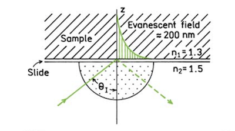
``` 

The intensity $I$ along the $z$ axis is given by
\begin{equation} 
I(z)=I(0)\exp{[-z/d]}
\end{equation} 

where $d$ is the penetration depth
\begin{equation} 
d=\frac{\lambda}{4\pi}\left[n_2^2\sin\theta_2-n_1^2 \right]^{-\frac{1}{2}}
\end{equation}

```{r,echo=FALSE,fig.margin = FALSE, fig.height=1, auto_pdf=TRUE, fig.align='center', fig.cap="TIR microscopy. To exploit Total Internal Reflection Fluorescence (TIRF) microscopy, fluorophores can be excited either using a prism to couple light into the sample, or through the same microscope objective lens as used for imaging. (Lakowicz)"}
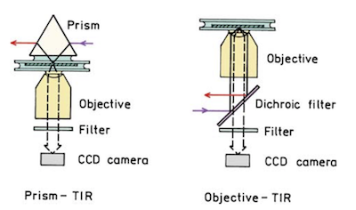
```


<!-- ```{r,echo=FALSE,fig.margin = TRUE, auto_pdf=TRUE, fig.align='center', fig.cap="Example TIRF image of single molecule fluroescence"}
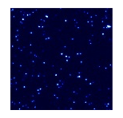
```  -->


## Fluorophore photophysics
Background noise is not the only problem for single-molecule fluorescence imaging, the fluorophores themselves must be robust and bright. Consider the electronic excited states of a molecule undergoing fluorescence.

```{r,echo=FALSE,fig.margin = FALSE, fig.height=1, auto_pdf=TRUE, fig.align='center', fig.cap="simplified Jablonski diagram depicting the fates of electronic excitation of fluorophores."}
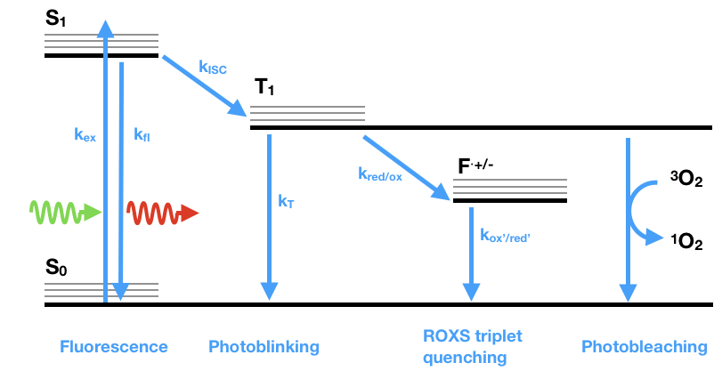
```
Molecules are excited from the ground state ($S_0$) to an excited singlet state ($S_1$) by the absorption of a photon. Following internal conversion, radiative decay from ($S_1$) results in fluorescence emission. Rarely (dependent on the relative rates of fluorescence and ISC), Molecules can undergo inter system crossing  (ISC) from ($S_1$) to a triplet state ($T_1$). To return from the ground state radiatively, molecules would have to undergo a  spin forbidden transition, rather they must decay non-radiately from $T_1$. In essence they are 'stuck' in $T_1$, and there is no fluorescence. 

```{r,echo=FALSE,fig.margin = TRUE, auto_pdf=TRUE, fig.align='center', fig.cap="Single-molecule photoblinking and photobleaching of rylene diimide dyes (Haase et al. PCCP 2011, 13, 1776)."}
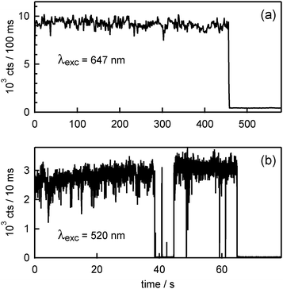
``` 

Consider the time-dependent fluorescent signal that you would see from a molecule; the emission would be intermittent, as the molecule gets trapped in the triplet state. This is termed **photoblinking**.


To help suppress photoblinking, an alternative pathway from $T_1$ is needed. The addition of a combination of reducing and oxidising agents (ROXS) enables  triplet quenching by electron transfer, via a a radical anion or cation intermediate.^[@vogelsang_2008-3g]

The ground state of molecular oxygen is a triplet ($^3\textrm{O}_2$), and as such it can also readily quench $T_1$. Unfortunately the by-product of this reaction is singlet oxygen ($^1\textrm{O}_2$) which is highly reactive. If $^1\textrm{O}_2$ reacts with the nearby conjugated $\pi$ system of the fluorophore, the result is irreversible chemical modification of the fluorophore and **photobleaching**.


# Applications of single-molecule fluorescence in biology

##Single-molecule FRET

```{r,echo=FALSE,fig.margin = TRUE, auto_pdf=TRUE, fig.align='center', fig.cap="FRET is the non radiative transfer of energy between two fluorophores."}
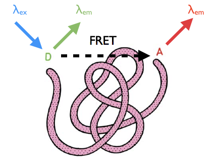
``` 

Förster Resonance Energy Transfer (FRET)^[@Lakowicz] ^[@HA200178] is the non-radiative dipole-dipole interaction between two fluorophores with overlapping emission and absorption spectra. The efficiency of FRET depends on $1/r^6$ of the separation of the two fluorophores, and as such can be used as a **molecular ruler**.

FRET is quantified in terms of an efficiency
\begin{equation}
E=\frac{k_{ET}}{k_f+k_{ET}+\sum\limits_i k_i}
\end{equation}

where $k$ indicates the rate constants associated with energy transfer ($k_{ET}$), fluorescence ($k_f$), and other photophysical processes affecting the excited state population ($k_i$).

```{r,echo=FALSE,fig.margin = TRUE, auto_pdf=TRUE, fig.align='center', fig.cap="Efficient FRET requires good overlap between donor emission and acceptor absorption spectra."}
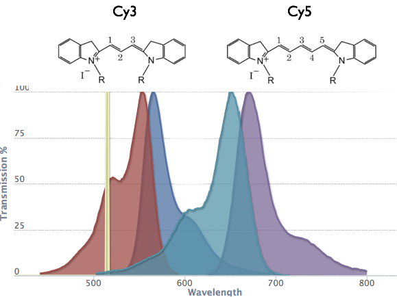
``` 

In terms of the distance $r$ between the fluorophores
\begin{equation}
E=\frac{R_0^6}{R_0^6+r^6}
\end{equation}

where $R_0$ is the **Förster radius** that defines when the transfer efficiency is 50%. For typical fluorophore pairs  the Förster radius is of the order of a few nanometres (e.g. Cy3 & Cy5 $R_0=55\textrm{\AA}$).


Experimentally, FRET can be measured by comparing the relative emission intensities from donor and acceptor.

\begin{equation}
\displaystyle E=\frac{I_A-\beta I_D}{I_A + \gamma I_D}
\end{equation}

```{r,echo=FALSE,fig.margin = TRUE, auto_pdf=TRUE, fig.align='center', fig.cap="FRET varies with fluorophore separation."}
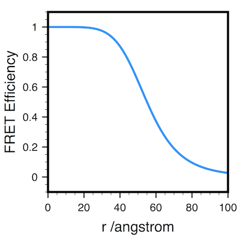
``` 

where $\beta$ and $\gamma$ are corrections for the unwanted fraction of donor signal in the acceptor channel or acceptor in donor, respectively.

Single-molecule FRET can thus be used to monitor conformational changes within biomolecules, quantify kinetics, and measure molecular distances. We will cover a number of examples in the lecture:

- Single-pair fluorescence resonance energy transfer on freely diffusing molecules: Observation of Förster distance dependence and subpopulations. Deniz et al. _Proc Natl Acad Sci U S A_ (1999), *96*, 3670–3675.
- Single-Molecule Fluorescence Resonant Energy Transfer in Calcium Concentration Dependent Cameleon. Brasselet et al. _The Journal of Physical Chemistry B_ (2000) *104*, 3676-3682.
- Single-molecule observation of protein–protein interactions in the chaperonin system. Taguchi et al. _Nature Biotechnology_ (2001)*19*, 861-865 

##Single-molecule fluorescence and kinetics
```{r,echo=FALSE,fig.margin = FALSE, auto_pdf=TRUE, fig.align='center', fig.cap="GroEL/ES binding using smFRET."}
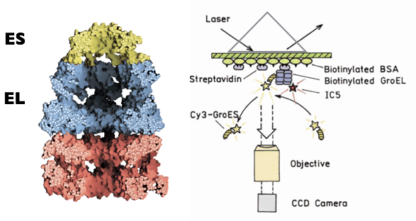
``` 
Although detecting single molecules might be considered difficult, analysing their kinetics is usually straightforward. Consider the case of the protein GroES binding to its partner GroEL , detected using single-molecule FRET (Taguchi Nat. Biotech. 2001).

```{r,echo=FALSE,fig.margin = TRUE, auto_pdf=TRUE, fig.align='center', fig.cap="Individual Fluorescence traces for GroEL/ES, along with on- and off- time distributions."}
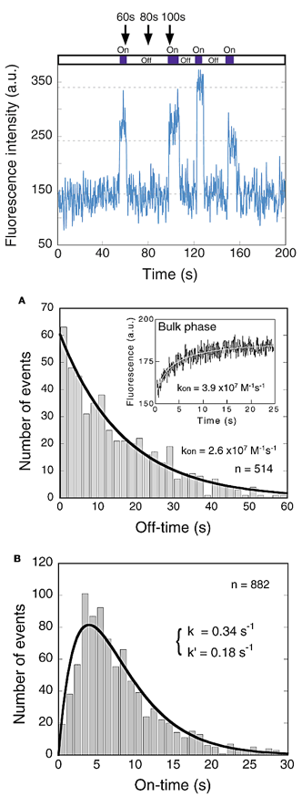
``` 

Each binding event is registered as an increase in fluorescence intensity. A histogram of all the recorded fluorescence on- and off-times can be constructed, and by fitting this distribution (typically with a single exponential for a simple first order reaction), the rate constant can be determined.


\newpage
##Fluorescence Correlation Spectroscopy
Rather than detecting a single diffusing molecule using confocal microscopy, we can also extract kinetic and concentration information from the dynamic fluctuations in signal from several molecules.^[@Lakowicz]

```{r,echo=FALSE,fig.margin = FALSE, auto_pdf=TRUE, fig.align='center', fig.cap="Fluorescence correlation spectroscopy. A confocal volume (left). Signal from a single diffusing molecule (middle). Signal from several molecules (right)."}
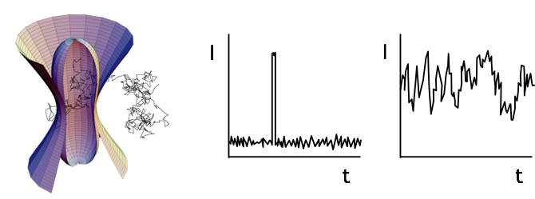
``` 

This is quantified by computing the **autocorrelation** of the fluorescence intensity. Autocorrelations ask "given a signal at a certain time, how likely is it to detect the same signal?"

```{r,echo=FALSE,fig.margin = TRUE, auto_pdf=TRUE, fig.align='center', fig.cap="Fluorescence Autocorrelation Function."}
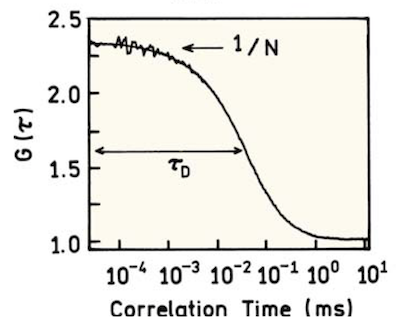
``` 

\begin{equation}
G(\tau)=\frac{\left<F(t)F(t+\tau)\right>}{\left<F\right>\left<F\right>}
\end{equation}

where $G$ denotes the autocorrelation function at a time delay $\tau$, and $\left<F\right>$ denotes the time-averaged fluorescence signal.

For simple 3D diffusion, the autocorrelation enables the retrieval of $\tau_D$, a characteristic time associated with diffusion across the confocal volume, and the average number of molecules in the volume. If the volume is known, the Diffusion coefficient and concentration can be determined.

##Stoichiometry
```{r,echo=FALSE,fig.margin = TRUE, auto_pdf=TRUE, fig.align='center', fig.cap="Stepwise photobleaching from a complex formed of 7 monomers."}
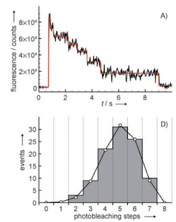
``` 

We can *exploit* photobleaching by counting the number of photobleaching steps in an individual molecular complex to determine its stoichiometry. If each protein subunit of a complex carrier a single fluorophore, as each of these fluorophores is destroyed by photobleaching we will resolve a single stepwise decay in fluorescence. We can count the number of steps to figure out how many fluorophores, and hence how many subunits were present. Due to limited signal:noise, the detection of each step is not 100% likely and there is a binomial distribution of detected steps.^[@das_2007-LF]

\newpage
#Fluorescence nanoscopy
```{r,echo=FALSE,fig.margin = FALSE, auto_pdf=TRUE, fig.align='center', fig.cap="We can determine the centre of mass of a molecule's image with very high precision - down to 1 nm."}
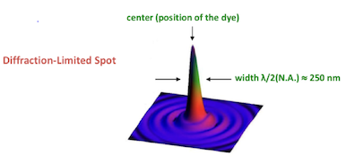
``` 
Even though the **diffraction limit** means that individual fluorescence molecules appear as 250nm-wide (approximately Gaussian) spots in an image, we can determine the position of the maxima of these spots to a much greater precision, down to around 1 nm. This precision can be estimated by considering the sources of noise in the image.^[@THOMPSON20022775]


\begin{equation}
\sigma_x = \sqrt{\frac{s_x^2}{N} + \frac{a^2/12}{N}  +  \frac{8\pi s_x^2 b^2}{a^2 N^2}  }
\end{equation}

here $s_x$ is the standard deviation of the point spread function in the x dimension (the half width of the spot), $a$ is the pixel size $N$ is the number of detected photons and $b$ is the number of background photons.

We can improve the precision by which the location of a fluorescence molecule is determined simply by collecting more photons. If the background noise is negligible, then this error scales as $\sigma_x \approx s \ \sqrt{N}$.

This is the basis of all **superresolution** or **optical nanoscopy** methods.^[@hell_2007-sd]

##Single particle tracking
We can use these methods to track the location of individual molecules, e.g. in the motion of motor proteins, or the diffusion of membrane proteins.

- Yildiz et al. Kinesin walks hand-over-hand. (2004) *Science* **303**, 676.
- Kusumi et al. Confined lateral diffusion of membrane receptors as studied by single particle tracking. *Biophysical J* (1993) **65** 2021.

##STORM/PALM
We can also exploit photoblinking to control the density of single emitters in an image. By turning on (and off) subsets of individual molecules and resolving their locations, we can build up a superresolved image.

```{r,echo=FALSE, fig.margin = TRUE, auto_pdf=TRUE, fig.align='center', fig.width=2,  fig.cap="Localisation microscopy (From Habuchi, Front Bioeng. Biotechnol.(2014))."}
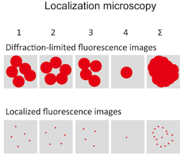
``` 

Let's take one example, the reversibly-photoswitchable fluorescent protein Dronpa. This protein has an absorption maximum at 503 nm and emits bright fluorescence (518 nm), it can be converted by irradiation at 488 nm and protonation into a dim state, switched back to the original emissive state with irradiation at 405 nm.

```{r,echo=FALSE,fig.margin = FALSE, auto_pdf=TRUE, fig.width=2, fig.align='center', fig.cap="Jablonski diagram for Dronpa Photoswitching  (From Sauer PNAS (2005) 102 9433-9434.)"}
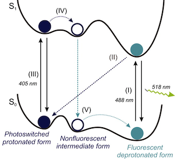
``` 

These techniques have been applied to help shed new light on a wide range of phenomena in cell biology. For example

- Fu, G.; Huang, T.; Buss, J.; Coltharp, C.; Hensel, Z.; Xiao, J. *PLoS ONE* (2010), **5**, e12682. 

\newpage
# Single molecule forces
In addition to detecting fluorescence from individual molecules, we can also measure the forces generated by individual molecules.

```{r,echo=FALSE,fig.margin = FALSE, fig.fullwidth=FALSE, auto_pdf=TRUE, fig.align='center', fig.cap="Forces in Biology. (From Clausen-Schaumann et al. Curr. Op. Chem Biol. 2000, 4, 524.) "}
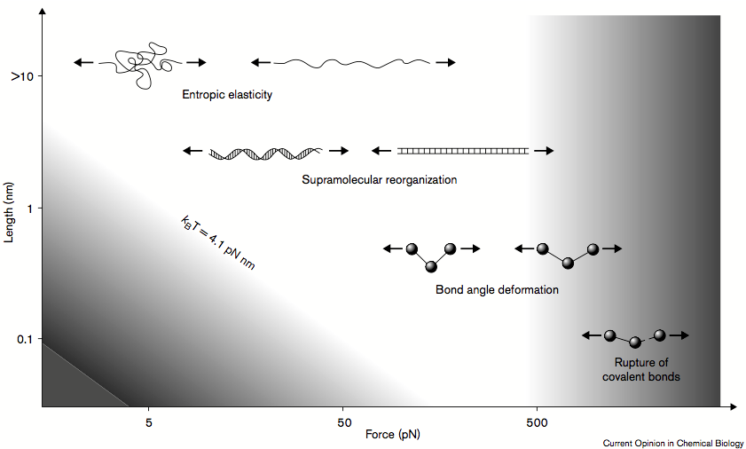
``` 

Different techniques are capable of accessing different force ranges with different temporal resolution, each suited to different biological problems.

Table: (\#tab:foo) Comparison of techniques used for the mechanical characterisation of biomolecules.

| Method| Forces /pN| Timescale /s| Applications| 
|------------:|-----------:|-----------:|-----------:|
|          Magnetic Beads|    0.01-100| 1| Stretching and twisting DNA|
|          Optical tweezers|    0.1-150| 1e-2| Actin, DNA, molecular motors|
|          Microneedles|    >0.1| 1e-1| Actin, stretching unzipping and twisting DNA|
|          AFM|    >1| 1e-5| DNA, proteins, receptor-ligand interactions|


##Optical Tweezers
Optical tweezers use radiation pressure to trap micron-sized objects in a focused laser. These trapping forces can be approximated as a simple spring with force proportional to displacement for a Gaussian beam.

```{r,echo=FALSE,fig.margin = TRUE, auto_pdf=TRUE, fig.align='center', fig.cap="Optical Tweezers. (Lakowicz)"}
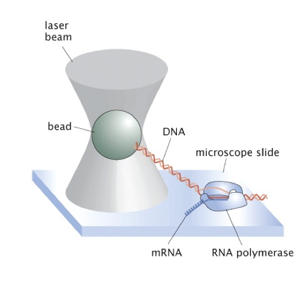
``` 
The basic principle behind optical tweezers is the momentum transfer associated with bending light. Light carries momentum that is proportional to its energy and in the direction of propagation.
Any change in the direction of light, by reflection or refraction, will result in a change of the momentum of the light. If an object bends the light, changing its momentum, conservation of momentum requires that the object must undergo an equal and opposite momentum change. This gives rise to a force acting on the object.

Consider the momentum associated with light acting on a particle. We must take account of the momentum change when light 'bounces off' the particle (scattering). If particle is made of a dielectric material that can refract the light, like a polystyrene bead for example, then we must consider the change in momentum of the system upon refraction. For trapping caused by refraction (assuming a simple Gaussian profile beam of light) the particle must have a higher index of refraction than that of the surrounding medium.

- **Scattering** gives rise to force component in the direction of incident light.
- **Refraction** gives rise to force component in the direction of intensity **gradient**.

```{r,echo=FALSE,fig.margin = FALSE, fig.fullwidth=FALSE, auto_pdf=TRUE, fig.align='center', fig.cap="Gradient forces in optical trapping."}
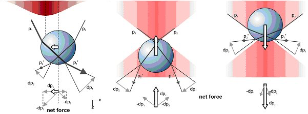
``` 
<!-- ```{r,echo=FALSE,fig.margin = FALSE, auto_pdf=TRUE, fig.align='center', fig.cap="Optical Tweezers. (Lakowicz)"}
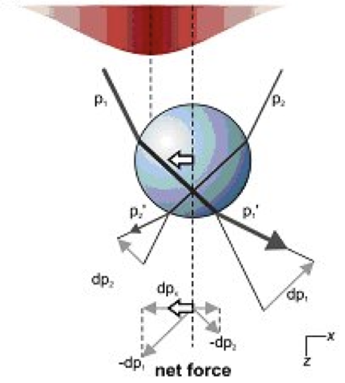
```  -->

So how to we quantify the forces on an optical trap? One simple method is to examine the thermal fluctuations of the trap and use the **equipartition theorem**.^[http://biopt.ub.edu/force-detection/equipartition-theorem]

\begin{equation}
\frac{1}{2}k_BT=\frac{1}{2}k\left<x^2\right>
\end{equation}

The expected probability distribution of trap positions is a Boltzmann distribution:

\begin{equation}
P(x,y)=A\exp\left(\frac{-k_x(x-x_0)^2}{2k_B T}\right)\exp\left(\frac{-k_y(y-y_0)^2}{2k_B T}\right)
\end{equation}

If we know the temperature, the width of the Gaussian-shaped histogram is directly related with the trap stiffness:

\begin{equation}
k_x=\frac{k_bT}{\sigma_x^2}
\end{equation}

Let's consider some real examples in the lecture:

- Ishijima et al. Cell, 92, 161-171, 1998
- Abbondanzieri et al. Nature 2005 438 460–465.

\newpage
##Atomic Force Spectroscopy
As well as generating nanometre-resolution images, AFM can be used to measure the forces between a biomolecule and a surface. In particular Atomic Force Spectroscopy can be used to measure the mechanical forces of biomolecule unfolding.
 
<!-- ```{r,echo=FALSE,fig.margin = TRUE, auto_pdf=TRUE, fig.align='center', fig.cap="Atomic Force Spectroscopy. (Lakowicz)"}
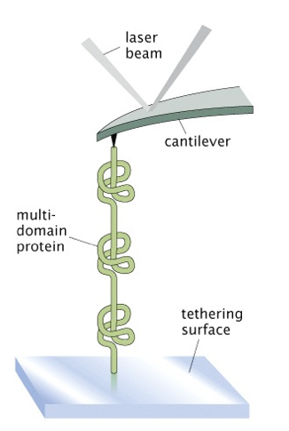
```  -->

```{r,echo=FALSE,fig.margin = FALSE, auto_pdf=TRUE, fig.align='center', fig.cap="Atomic Force Spectroscopy can be used to measure protein unfolding."}
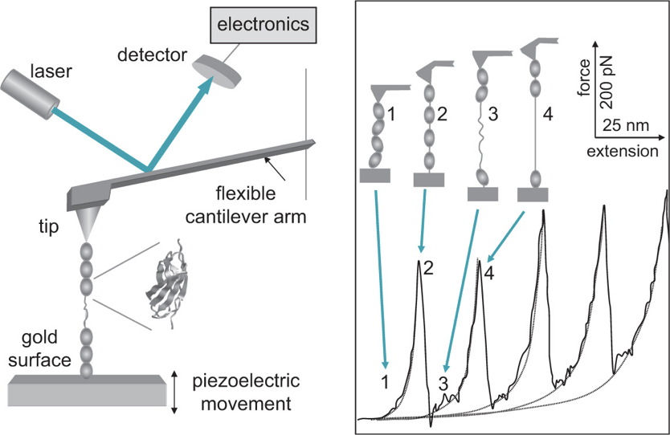
```

Typically, the AFM tip is tethered to protein, the other end of the protein to a surface, and the tip is then gently pulled upwards whilst the deflection on tip is measured. A force-induced bond rupture can be thought of as a thermally driven transition from a bound state into an unbound state over a potential energy surface.^[Further detail in Phillips, Physical Biology of the Cell (Garland)] Fitting the profile of the force-extension curve tells you about the nature of the biopolymer.

For example,

- Li et al. *PNAS* 2000 **97** 6527
- Lee, E. H.; Hsin, J.; Mayans, O.; Schulten, K. *Biophys J* 2007, 93, 1719–1735.


 \newpage
 
#Single channel electrophysiology
```{r,echo=FALSE,fig.margin = FALSE, auto_pdf=TRUE, fig.align='center', fig.cap="A simple schematic of Ion channel gating."}
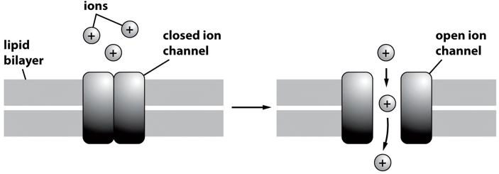
```
```{r,echo=FALSE,fig.margin = TRUE, auto_pdf=TRUE, fig.align='center', fig.cap="Patch clamp (From Phillips Physical Biology of the Cell.)."}
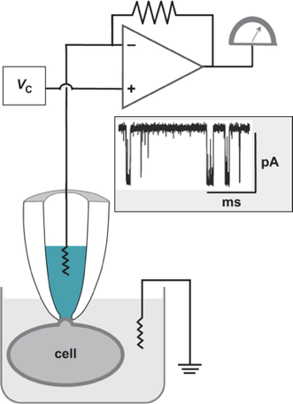
```

Measurements of the ionic current through individual protein channels provided the first 'single molecule' technique. Around 100 million ions per second can be measured from the current flowing through an open channel. Compare this to the ~1 million photons per second per molecule available to detected using fluorescence.


##Patch clamping

In a **patch clamp** experiment, a tight seal between a micron-sized glass capillary and a cell membrane is used to record the ionic current from an individual channel.

```{r,echo=FALSE,fig.margin = FALSE, auto_pdf=TRUE, fig.align='center', fig.cap="Single channel recording."}
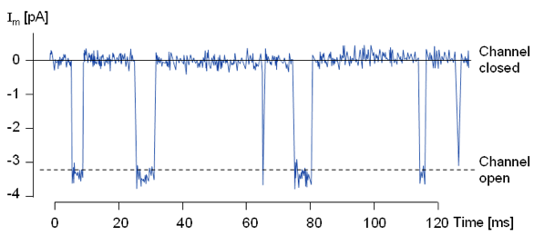
```
By exploiting this $\textrm{G} \Omega$ seal, and sensitive current amplification the flow of ions through a single channel can be measured.

## Single channel kinetics
Just as with single-molecule fluorescence, rate constants can be extracted by examining the distribution of dwell times in different open and closed states. 

\newpage
## Voltage-gated ion channels
Gating transitions of ion channels can be thought of as a simple two-state system with a single free energy barrier. As such, we can use the tools of statistical thermodynamics to understand what's going on.

```{r,echo=FALSE,fig.margin = FALSE, auto_pdf=TRUE, fig.align='center', fig.cap="Cartoon of Voltage Gated Channel gating (Phillips)."}
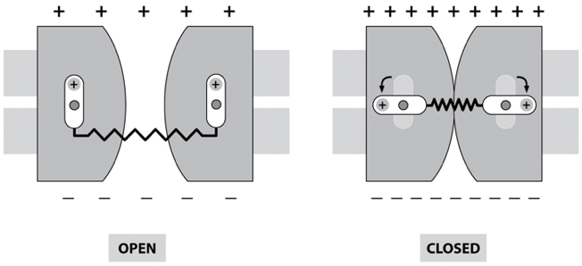
```

Consider voltage-gated ion channels as one example: Voltage-gated channels respond to changes in membrane potential, as a voltage sensor portion of the protein responds and reduces conformational degrees of freedom for the channel.

```{r,echo=FALSE,fig.margin = FALSE, auto_pdf=TRUE, fig.align='center', fig.cap="Free energy as a function of radius for a model voltage-gated ion channel."}
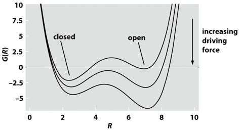
```

For this two state system, the partition function $q$ is easy to write out.

\begin{equation}
q=\sum_i e^{-\beta E}
\end{equation}

\begin{equation}
q= e^{-\beta \epsilon_{cl}}+e^{-\beta \epsilon_{op}}
\end{equation}

So the probability of being in the open state is
\begin{equation}
p_{op}= \frac{e^{-\beta\epsilon_{op}} }{ e^{-\beta \epsilon_{cl}}+e^{-\beta\epsilon_{op}} }
\end{equation}

\begin{equation}
p_{op}= \frac{e^{-\beta\Delta \epsilon} }{ 1+e^{-\beta\Delta \epsilon} }
\end{equation}

Let's separate energy difference $\Delta\epsilon$ into that due to conformational differences, and that due to different charge motions.
\begin{equation}
\Delta \epsilon = \Delta \epsilon_{conf} - \mu \frac{V_{mem}}{d}
\end{equation}

here $\mu$ is the dipole moment and $V_{mem}/d$ is the electric field across the membrane. If we define a midpoint for the vaule of the potential with $p_{op}=0.5$ and $\delta\epsilon=0$ we can simplify our expression. Using

\begin{equation}
V^*=\frac{d\Delta\epsilon_{conf}}{\mu}
\end{equation}

and realising $q=\mu / d$ we can rewrite our expression for the open probability.

\begin{equation}
p_{op}= \frac{1} {1+ e^{\beta q (V^*-V_{mem})} }
\end{equation}


```{r,echo=FALSE, fig.margin = FALSE, auto_pdf=TRUE, fig.align='center', fig.cap="Open probability calculation for a voltage gated ion channel (left). Compared to a real channel (right) (From Rhodes et al. PNAS 2004 101 (30) 11147-11152). "}
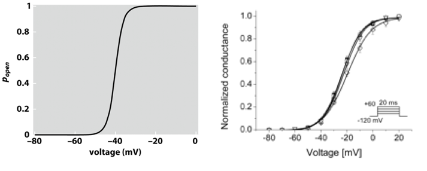
```

So how well does this work? Pretty well!

<!-- `r if (knitr:::is_html_output()) '# References {-}'` -->

\newpage
## Nanopore sensing
Some proteins don't gate, but rather make open pores in membranes. Binding of analytes to these pores restricts the flow of ionic current, this can be used to sense molecules such as DNA.

```{r,echo=FALSE,fig.margin = FALSE, fig.fullwidth=FALSE, auto_pdf=TRUE, fig.align='center', fig.cap="Binding of DNA within a nanopore results in diffrences in residual current (From Stoddart, D.,et al. PNAS 106, 7702–7707 (2009))."}
knitr::include_graphics("img/NanoporeSensing.png")
```

For example, using the $\alpha$-hemolysin pore from S.aureus, you can detect the differences in current from individual base pairs present in the pore.

# References


